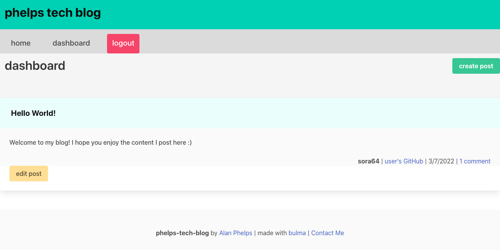

# phelps-tech-blog

## Description

This is a CMS-style blog site where users can publish articles, blog posts, and their thoughts and opinions.

## Table of Contents

- [Installation](#installation)
- [Usage](#usage)
- [Link](#link)
- [Screenshot](#screenshot)
- [Questions](#questions)
- [License](#license)

## Installation

Make sure to intsall the appropriate packages by running "npm i" in the terminal. Also, update the .env file to include your MySQL shell login information. Alternatively, you could go to the deployed applications URL.

## Usage

This application is a simple blog, used to express thoughts and opinions.

## Link

[https://phelps-tech-blog.herokuapp.com/dashboard](https://phelps-tech-blog.herokuapp.com/dashboard)

## Screenshot

## Questions

- GitHub: [sora64](https://github.com/sora64/)

- Email: If you have any other questions, please reach me at [phelpsa64@gmail.com](mailto:phelpsa64@gmail.com).

## License

This application is covered under the [ISC](https://opensource.org/licenses/ISC) license.
